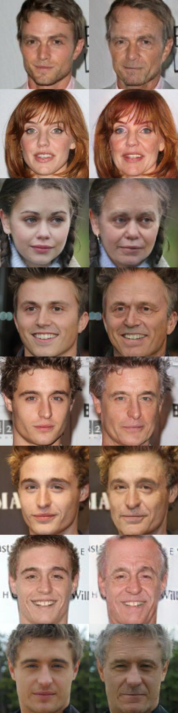
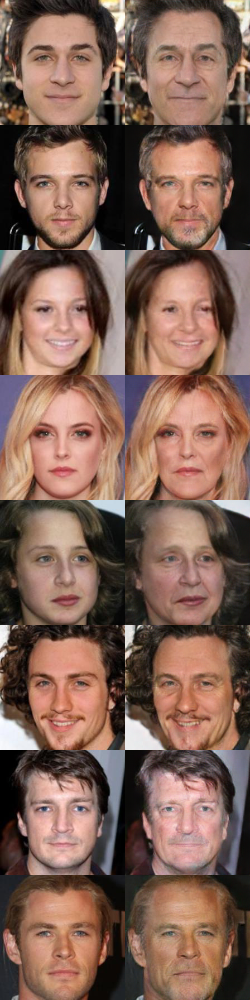
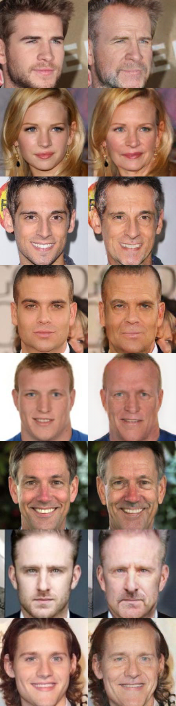

# Learing Face Age Progression: A Pyramid Architecture of GANs
Hongyu Yang, Di Huang, Yunhong Wang, and Anil K. Jain
### Abstract
The two underlying requirements of face age progression, i.e. aging accuracy and identity permanence, are not well studied in the literature. In this paper, we present a novel generative adversarial network based approach. It separately models the constraints for the intrinsic subject-specific characteristics and the age-specific facial changes with respect to the elapsed time, ensuring that the generated faces present desired aging effects while simultaneously keeping personalized properties stable. Further, to generate more lifelike facial details, high-level age-specific features conveyed by the synthesized face are estimated by a pyramidal adversarial discriminator at multiple scales, which simulates the aging effects in a finer manner. The proposed method is applicable to diverse face samples in the presence of variations in pose, expression, makeup, etc., and remarkably vivid aging effects are achieved. Both visual fidelity and quantitative evaluations show that the approach advances the state-of-the-art. For more details, please refer to our [CVPR paper](http://openaccess.thecvf.com/content_cvpr_2018/papers/Yang_Learning_Face_Age_CVPR_2018_paper.pdf). 


##
In this repository we provide the pretrained aging models and the code for running the models on new face images. 

## Some example age-progressed faces:
<div align='center'>
  
  
  
  
</div>


## Setup
The code is implemented in [Torch7](http://torch.ch/).

First [install Torch](http://torch.ch/docs/getting-started.html#installing-torch), then install the following packages:

```bash
luarocks install torch
luarocks install nn
luarocks install image
luarocks install lua-cjson
```

### (Optional) GPU Acceleration

If you use an NVIDIA GPU, you can accelerate the operations with CUDA.

First [install CUDA](https://developer.nvidia.com/cuda-downloads), then install the following packages:

```bash
luarocks install cutorch
luarocks install cunn
```

### (Optional) cuDNN

You can use cuDNN to accelerate convolutions.

First [download cuDNN](https://developer.nvidia.com/cudnn) and copy the
libraries to `/usr/local/cuda/lib64/`. Then install the Torch bindings for cuDNN:

```bash
luarocks install cudnn
```


## Pretrained Models
Download the pretrained models to the folder `models/`.
* [CACD](https://drive.google.com/file/d/1q0O9CTCNfAjLOKXywggLz6fU3zrmfNJ9/view?usp=sharing)
* [MORPH](https://drive.google.com/file/d/1hvmRg6zW6EdVLruNgrQF21WrT-AeH7_M/view?usp=sharing)


## Running on new images
The script `make_aging_dataset.py` lets you put the face images into the hdf5 file:
```bash
python scripts/make_aging_dataset.py
```

The script `test_aging.lua` lets you use a trained model to aging the face images:
```bash
th test_aging.lua
```
By default this script runs on GPU.

If you find this code useful for your research, please cite

```
@inproceedings{Yang2018FaceAgeProgression,
  title={Learning Face Age Progression: A Pyramid Architecture of GANs},
  author={Yang, Hongyu, and Huang, Di and Wang, Yunhong and Anil K. Jain},
  booktitle={IEEE Conference on Computer Vision and Pattern Recognition (CVPR)},
  year={2018}
}
```
